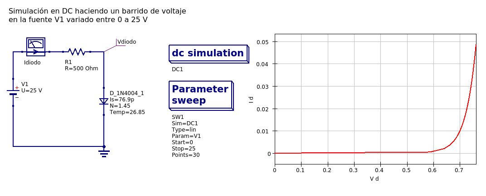
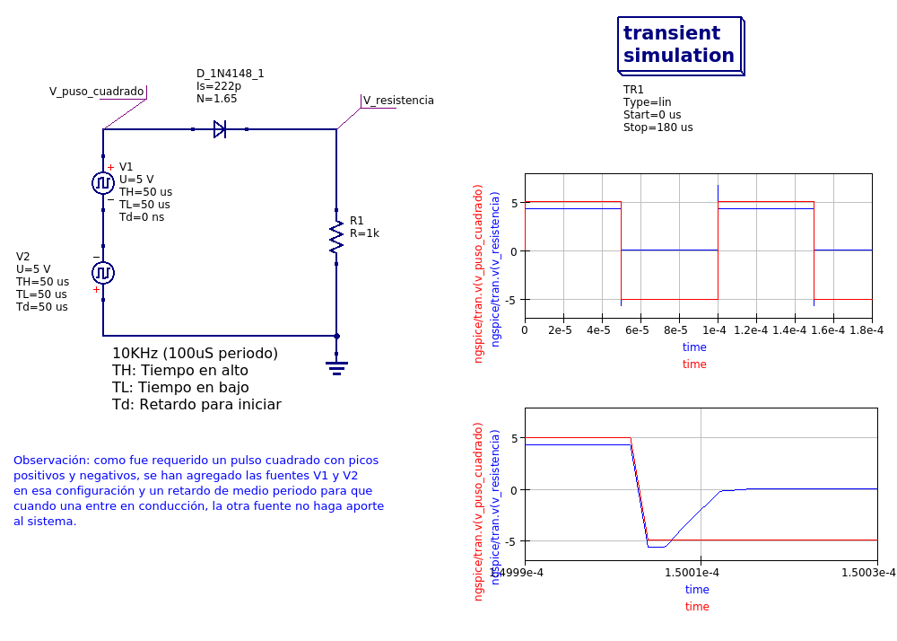

# Simulación de Diodos

## Simulación DC comportamiento del diodo en función de una fuente de voltaje variable

## Simulación transitorio diodo en función de fuente de señal cuadrada de 5 Vpp @ 10 KHz

