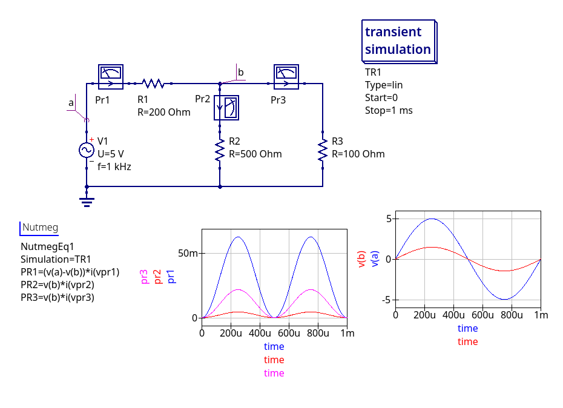

# Calular potencia a través de ecuaciones

En este ejemplo se muestra cómo calcular un subproducto a través de ecuaciones,
Tenga presente que del tema potencia los términos son amplios, (potencia activa, aparente, compleja...)

Regards,

Johnny

