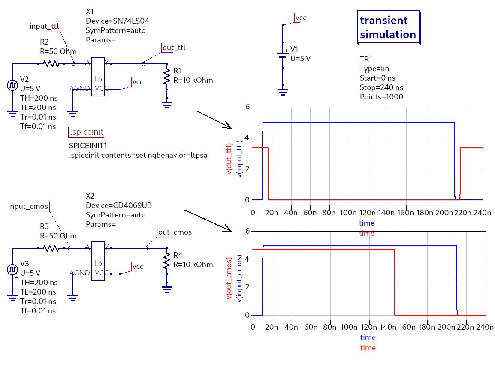

# Ejemplo de uso de un modelo PSPICE en qucs




Para instalar las librerías de los modelos spice, ejecute en la terminal los siguientes comandos:

```
mkdir -p ~/.qucs/user_lib/
cp ./SN74LS04.lib ~/.qucs/user_lib/
cp ./CD4069UB.lib ~/.qucs/user_lib/

```
