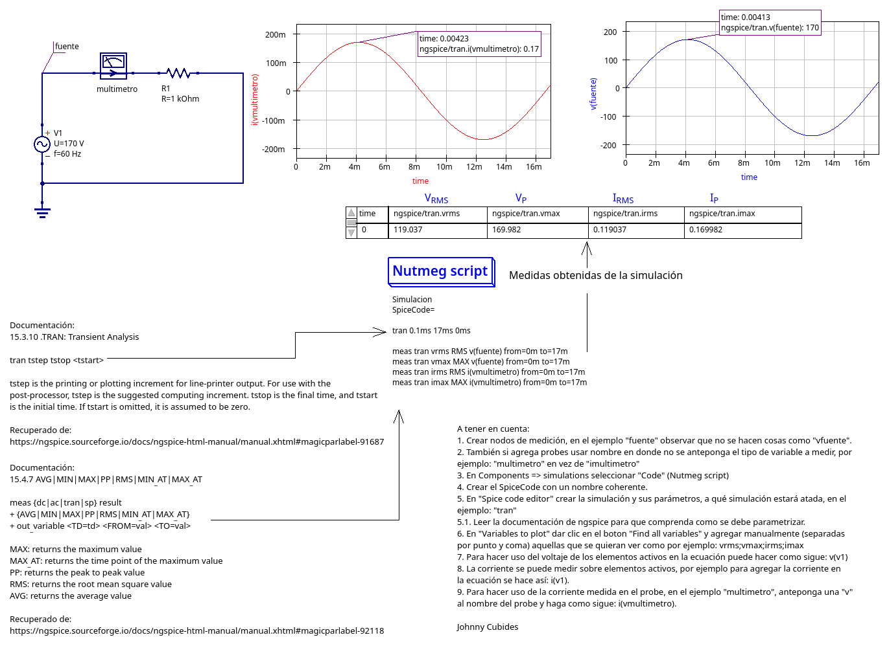

# Simulación de Valores RMS

En este ejemplo se muestra gráficamente la simulación de una
fuente alterna con valores de tensión y corriente pico con sus
respectivos valores RMS.

## Referencias

[Lista de caracteres usables en qucs](http://web.mit.edu/qucs_v0.0.19/docs/en/characters.html)

[Manual de motor de simulación Ngspice](https://ngspice.sourceforge.io/docs/ngspice-html-manual/manual.xhtml)

