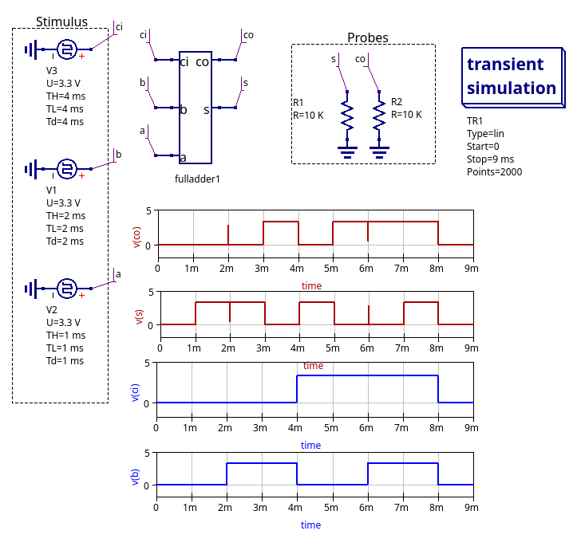

# Simulación de un sumador completo

En esta simulación se hace un diseño jerárquico como sigue:

* [halfadder.sch](./halfadder.sch) diseño en xspice de sumador medio
* [./fulladder.sch](./fulladder.sch) diseño en xspice de sumador completo
haciendo uso del sumador medio anteriormente descrito.
* [./fulladder_tb.sch](./fulladder_tb.sch) banco de pruebas del sumador completo

## Banco de pruebas del sumador completo

## Sumador completo

## Sumador medio

