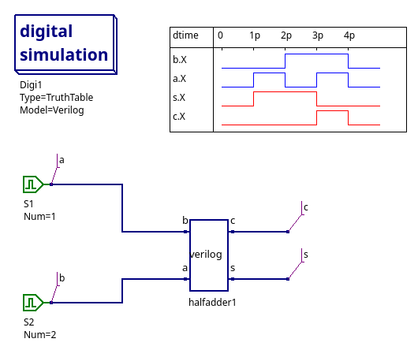

# Simulación de un sumador medio en verilog



1. Se crea un archivo verilog con la descripción del circuito en el
lenguaje verilog. En este caso se ha creado el archivo `halfadder.v`
y se ha guardado en él la siguiente descripción:

```verilog
module halfadder (
    // Inputs and output ports
    input  b,
    output c,
    input  a,
    output s
);

  // Descripción del comportamiento
  assign s = a ^ b;
  assign c = a & b;
endmodule
```

Se selecciona en los componentes -> Digital-components -> **verilogfile**
y en las propiedades a editar se agrega la ruta del archivo verilog creado.

Se agregan los demás componentes como es aprecia en la imagen. Se recomienda
ordenar los estímulos para que obtenga la tabla de verdad de la salida de la Simulación
para que le pueda realizar el seguimiento deseado.


