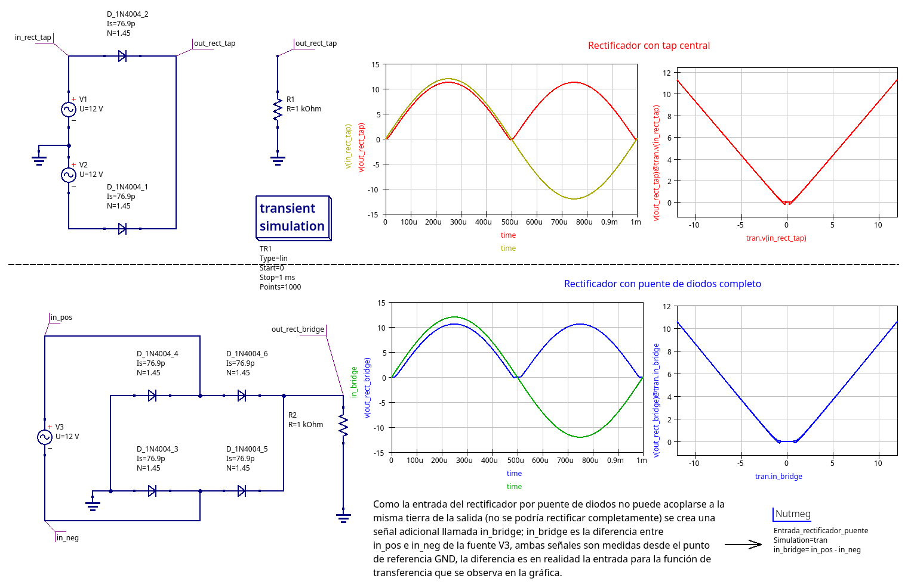

# Rectificación DC

A continuación se muestra la simulación de dos posibles configuraciones de rectificación:

* Rectificación por puente de diodos completo
* Rectificación por medio puente de diodos y tap central

Preste atención en los detalles relacionados por ejemplo:

* Caidas de tensión en la señal de salida debido a la tensión de los diodos en ambas configuraciones.
* Ecuación `in_bridge` que es la diferencia de las tensiones en los diodos de la fuente AC V1 con respecto a GND

Johnny Cubides
