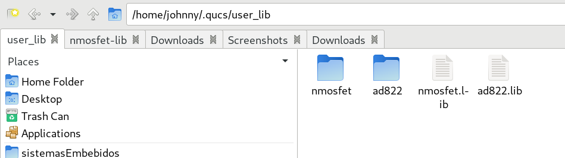
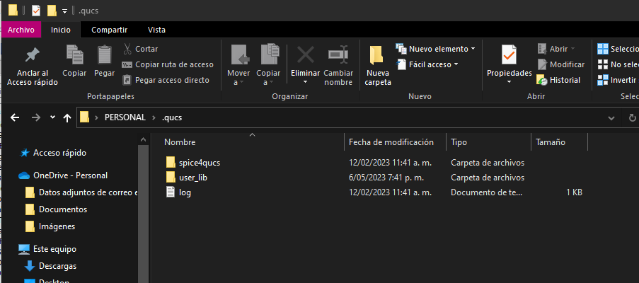
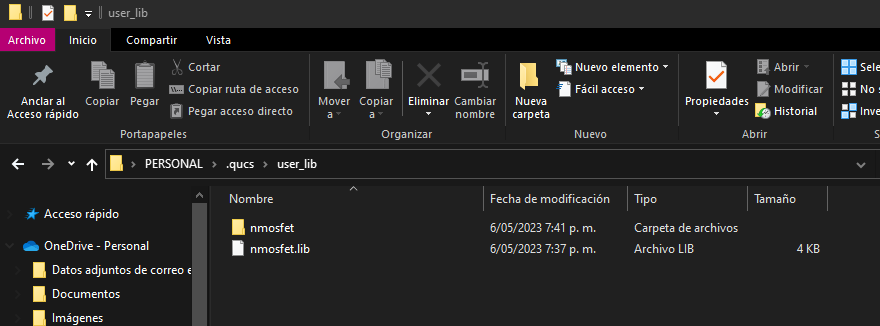
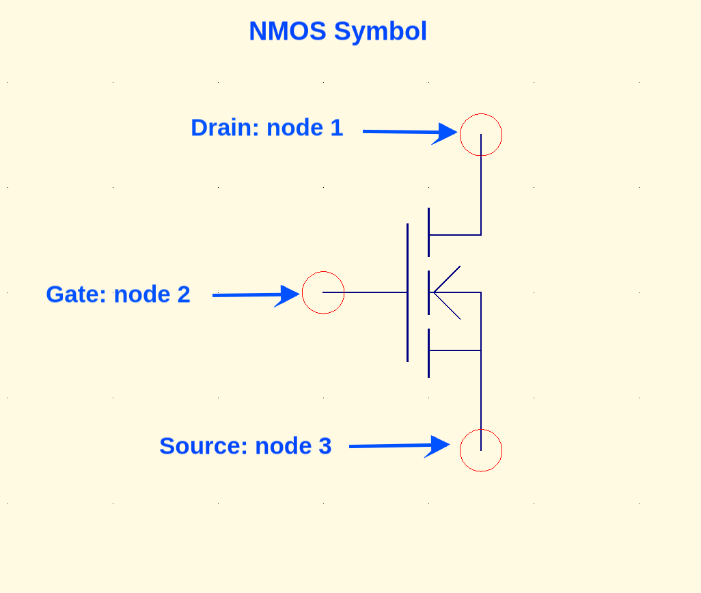
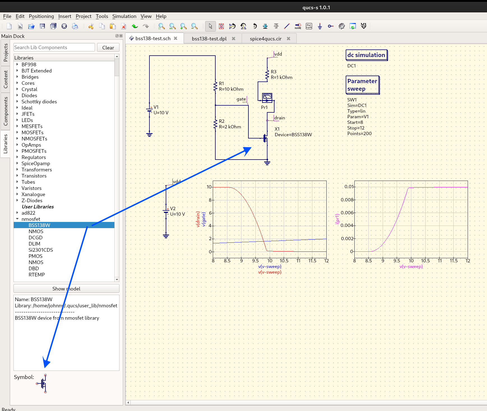

# Nmosfet.lib agregado a qucs desde el modelspice

Este es un ejemplo de como agregar un componente al simulador de qucs a través de su modelo spice.

## ¿Cómo usar estos spices model?

Deberá crear un directorio `user_lib` en `.qucs/` donde haya instalado qucs, en el cual se deberá agregar:

* El archivo `nmosfet.lib` que representa los modelos spices de diferentes nmosfet.
* EL directorio `nmosfet/` que representa el símbolo usable en qucs para los mosfets.

**Ejemplo en Linux**:



**Ejemplo en Windows**: (Observe la ruta, desde el usuario personal: `C:\PERSONAL\.qucs`)

**Nota**: Si instaló alguna versión anterior de Qucs, por favor revisar que se haya borrado
el contenido de esa anterior instalación, pueda que la ruta descrita no funcione como configuración
de `user_lib`.




El símbolo usado tiene la siguiente configuración la cual debe corresponder al orden del modelspice
del subcircuito que representa al componente electrónico.

Observe el siguiente ejemplo:

1. Símbolo del nmosfet con los respectivos nodos.



2. Ejemplo de un modelo spice dentro del archivo `nmosfet.lib`

```cir
*---------- BSS138W Spice Model ----------
.SUBCKT BSS138W 10 20 30 
*     TERMINALS:  D  G  S
M1 1 2 3 3 NMOS L = 1E-006 W = 1E-006 
RD 10 1 0.9338 
RS 30 3 0.001 
RG 20 2 47 
CGS 2 3 1.906E-011 
EGD 12 0 2 1 1 
VFB 14 0 0 
FFB 2 1 VFB 1 
CGD 13 14 4.9E-011 
R1 13 0 1 
D1 12 13 DLIM 
DDG 15 14 DCGD 
R2 12 15 1 
D2 15 0 DLIM 
DSD 3 10 DSUB 
.MODEL NMOS NMOS LEVEL = 3 VMAX = 8E+005 ETA = 1E-012 VTO = 1.422 
+ TOX = 6E-008 NSUB = 1E+016 KP = 0.5025 U0 = 400 KAPPA = 7.117 
.MODEL DCGD D CJO = 9.463E-012 VJ = 6.446 M = 0.9816 
.MODEL DSUB D IS = 7.582E-010 N = 1.586 RS = 0.1976 
+ BV = 65 CJO = 1.173E-011 VJ = 0.03727 M = 0.2868 
.MODEL DLIM D IS = 0.0001 
.ENDS BSS138W
```

**Observación 1**: Observe la línea relacionada al subcircuito la cual tiene el siguiente orden:

.SUBCKT BSS138W 10 20 30 

Los nodos 10, 20 y 30 corresponde a el nodo Drain: 1, Gate: 2 y Source: 3, que corresponden exactamente al orden de los nodos del símbolo señalado.

**Observación 2**: En el `./nmosfet.lib` puede agregar cuantos .SUBCKT puedan corresponder al orden de los nodos
del simbolo que para este caso representa los nmos.

A continuación se muestra la librería siendo usada en Qucs.




## Referencias

* [Ejemplo de librería agregada a Qucs](https://github.com/ra3xdh/qucs_spicelib)
* [Usar spice model in qucs](https://qucs-help.readthedocs.io/en/spice4qucs/SubLib.html#using-manufacturers-component-data-libraries)
