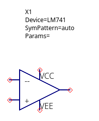

# Modelo spice y símbolo para el lm741

El lm741 es un amplificador operacional.

Para agregar el modelo spice deberá agregar descargar el [lm741.zip](./lm741.zip) en el Directorio `.qucs/user_lib`
el cál se encuentra en el directorio de su usuario personal o donde haya instalados qucs.

Regards,

Johnny
2023-10-05
