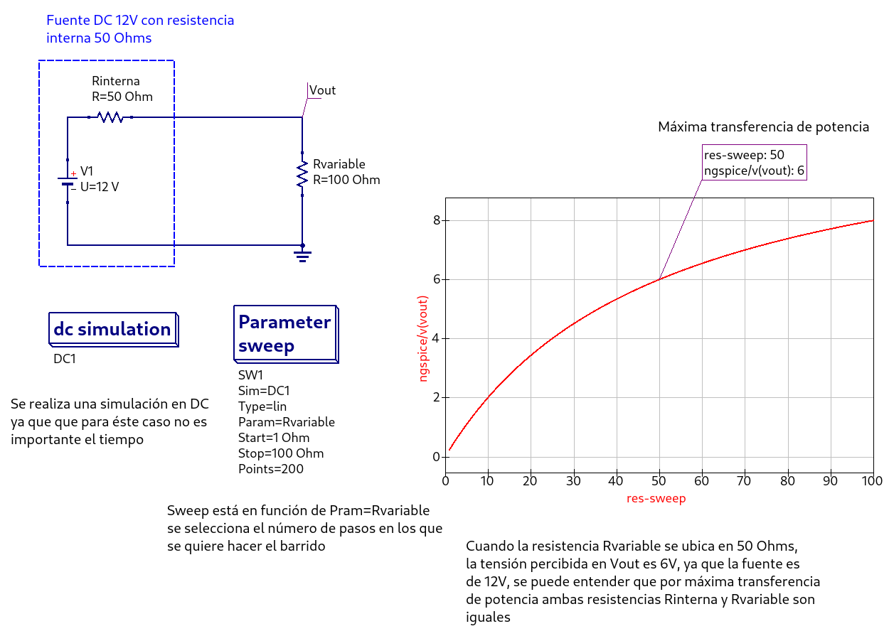

# Resistencia variable

En este ejemplo se simula la máxima transferencia de
potencia lo cual sucede cuando la tensión cae a la mitad
en vout, se observa como la resitencia interna es igual a
resistencia de prueba rvariable.

