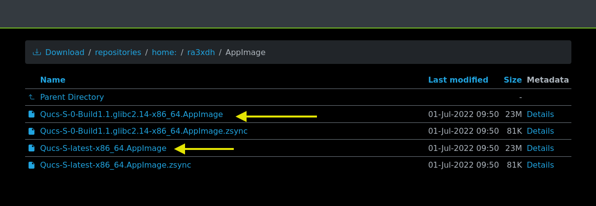
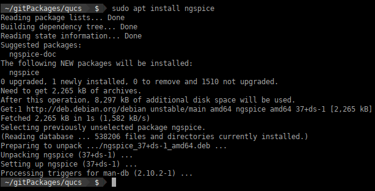
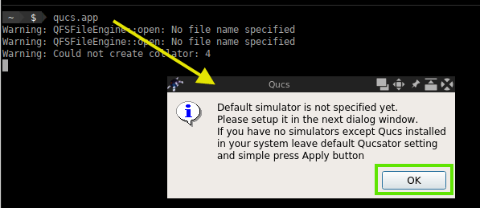
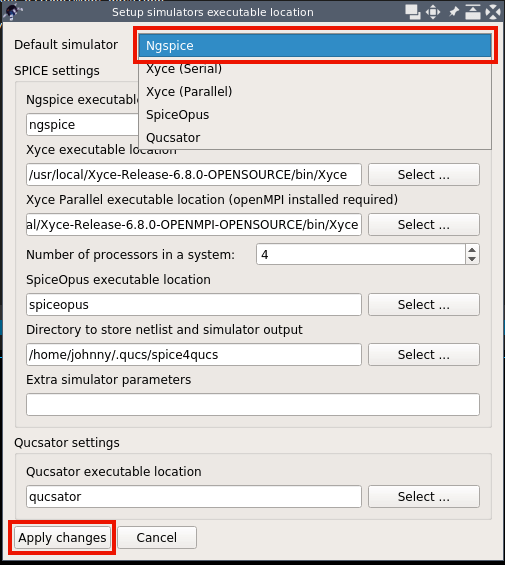

# Instalación de qucs en debian


> **¡Tenga en cuenta!** Las instrucciones que van delante del símbolo ` $ ` son aquellas a realizar en el prompt de la consola; deberá copiarlas y
> pegarlas en la consola para luego ejecutarlas. Las demás líneas o campos son salidas o resultados de una operación que podrá usar como
> comparación.

Enlace de los repositorios de qucs:

[https://github.com/ra3xdh/qucs_s](https://github.com/ra3xdh/qucs_s)

## AppImage

Descargar del [enlace qucs release](https://github.com/ra3xdh/qucs_s/releases) el archivo
correspondiente a la imagen de la aplicación de qucs, en este ejemplo, la imagen está comprimida
en un archivo .zip



## Instalación de qucs

Para instalar qucs en el sistema puede ejecutar las siguientes instrucciones:

```bash
 ~  $  cd ~
 ~  $  mkdir -p ~/gitPackages/qucs   # Crear directorio que contendrá la aplicación Qucs
 ~  $  unzip ~/Downloads/Qucs-S-x86_64-Linux.AppImage.zip -d ~/gitPackages/qucs/ # Descomprime la aplicación en el directorio creado
Archive:  /home/johnny/Downloads/Qucs-S-x86_64-Linux.AppImage.zip
  inflating: /home/johnny/gitPackages/qucs/Qucs-S-x86_64-Linux.AppImage
 ~  $  cd ~/gitPackages/qucs # Ir al directorio donde está la app de qucs
 ~/gitPackages/qucs  $  ls # Ver el contenido del directorio
Qucs-S-x86_64-Linux.AppImage
 ~/gitPackages/qucs  $  mv Qucs-S-x86_64-Linux.AppImage qucs.app # Renombrar la app
 ~/gitPackages/qucs  $  chmod +x qucs.app # Dar permisos de ejecución
 ~/gitPackages/qucs  $  sudo ln -sr qucs.app /usr/local/bin/ # Crear enlace simbólico
[sudo] password for johnny: 
 ~/gitPackages/qucs  $  qucs.app # Abrir la aplicación
```

> **Nota**: Si la aplicación no está comprimida puede saltar ese paso y mover el archivo con la instrucción `mv`, ejemplo:
> ` ~  $  unzip ~/Downloads/Qucs-S-x86_64-Linux.AppImage ~/gitPackages/qucs/`

## Instalación de ngspice

Las siguientes instrucciones actualizan los apuntadores de los archivos precompilados en la nube (como es el caso de ngspice)
y seguido instala la versión de ngspice disponible.


```bash
~  $  sudo apt update # Actualiza los sourcelist
~  $  sudo apt install ngspice # Instala ngspice desde un precomilado
```



## Lanzar qucs

```bash
 ~/gitPackages/qucs  $  qucs.app # Abrir la aplicación

```



> **Nota**: Observe que al iniciar qucs por primera vez indicará que requiere configurar el motor de simulación.

## Configurar ngspice en qucs

Ngspice es un motor de simulación en constante desarrollo, este motor ya se encuentra en su versión 40+ estable,
para la configuración en Linux bastará con indicar en la ventada de SetUp el nombre del simulador.



Para finalizar basta con probar los ejemplos que encontrará en este repositorio.

Regards,

Johnny Cubides
