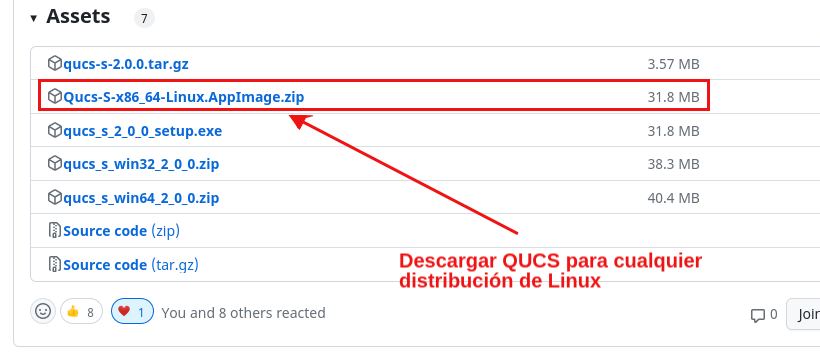

# Instalación de qucs en debian

Enlace de los repositorios de qucs:

[https://github.com/ra3xdh/qucs_s](https://github.com/ra3xdh/qucs_s)

## AppImage



## Instalación de qucs

```bash
 ~/gitPackages/qucs  $  pwd
/home/johnny/gitPackages/qucs
 ~/gitPackages/qucs  $  ls
Qucs-S-0-Build1.1.glibc2.14-x86_64.AppImage
 ~/gitPackages/qucs  $  mv Qucs-S-0-Build1.1.glibc2.14-x86_64.AppImage qucs.app
 ~/gitPackages/qucs  $  chmod +x qucs.app 
 ~/gitPackages/qucs  $  sudo ln -sr qucs.app /usr/local/bin/
[sudo] password for johnny: 
 ~/gitPackages/qucs  $  
```


## Instalación de ngspice


```bash
sudo apt install ngspice
```

## Lanzar qucs


## Configurar ngspice en qucs


